1.调查并记录实验环境的如下信息：
当前Linux发行版基本信息：

在命令行中输入：lsb_release -a查看当前Linux发行版基本信息

查看结果如下图：

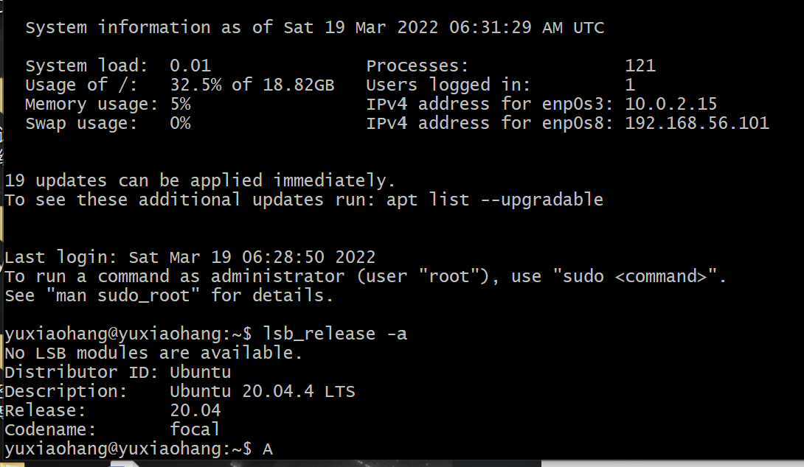

当前Linux内核版本信息：

在Git Bash里面输入命令行：nuame -a查看当前Linux内核版本信息

查看结果如下图：

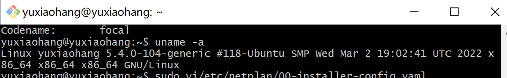

2.Virtualbox 安装完Ubuntu之后新添加的网卡如何实现系统开机自动启用和自动获取IP；

先在Git Bash中用ip a代码查看网卡的信息，如果新的网卡没有显示，则需要对新的网卡进行配置
配置的代码为sudo vim /etc/netplan/00-installer-config.yaml

结果如下图

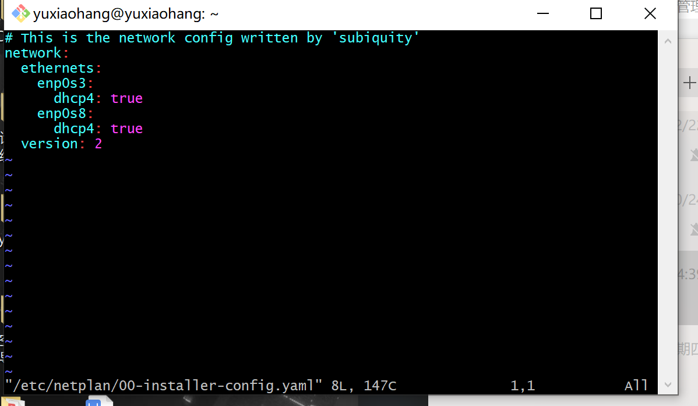

添加新的网卡到这个文件里，即将enp0s9: dacp4: true 信息填入并保存，然后执行命令sudo netplan apply 使其生效，随后通过ip a即可看到新的网卡添加成功

3.如何使用scp在「虚拟机和宿主机之间」、「本机和远程Linux系统之间]传输文件?

在虚拟机和宿主机之间传输文件:

先在虚拟机上建立文件test内容为first
代码ls查看文件目录
代码pwd查看文件路径
如下图：

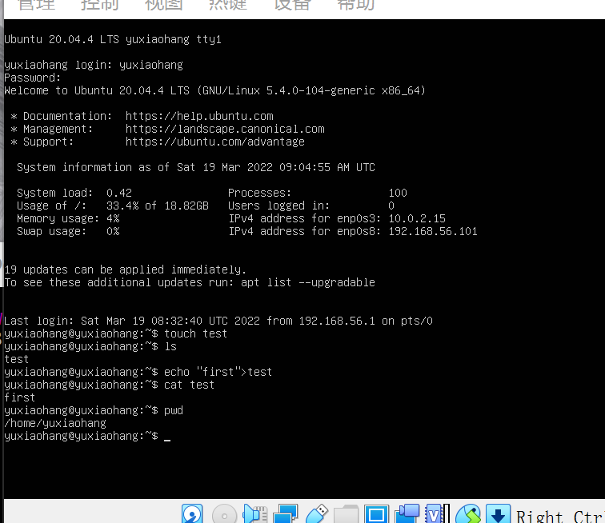

代码scp -r yuxiaohang@192.168.56.101:/home/yuxiaohang ./ 将虚拟机上的文件传输到宿主机上,可以看到下图左下角出现的“yuxiaohang”的文件

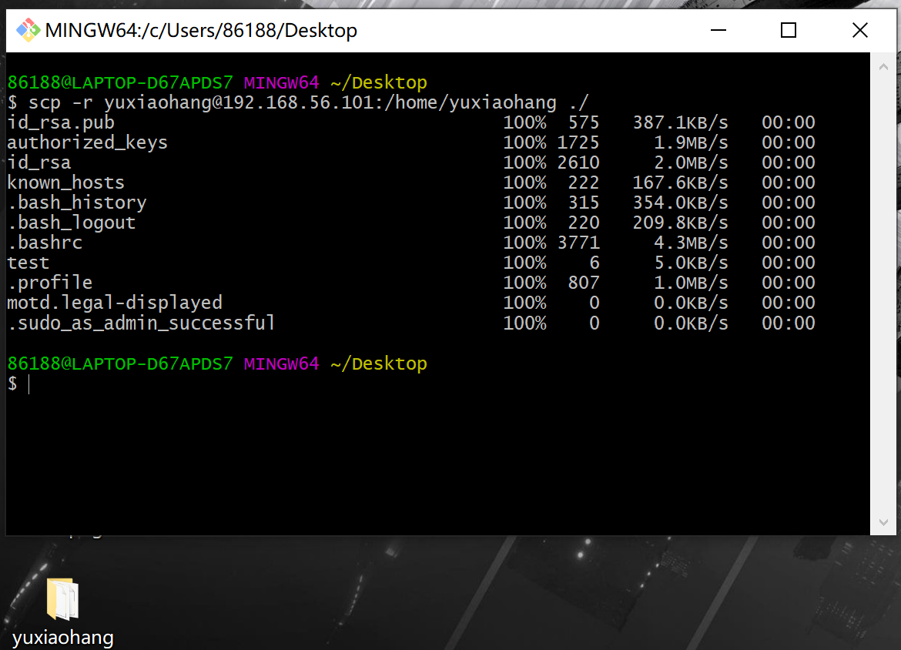

在宿主机上建立文件text1.4.txt
代码scp text1.4 yuxiaohang@192.168.56.101:/home/yuxiaohang ./ 将宿主机上的文件传输到虚拟机上
代码ls 查看已传输文件
执行过程如下图所示：
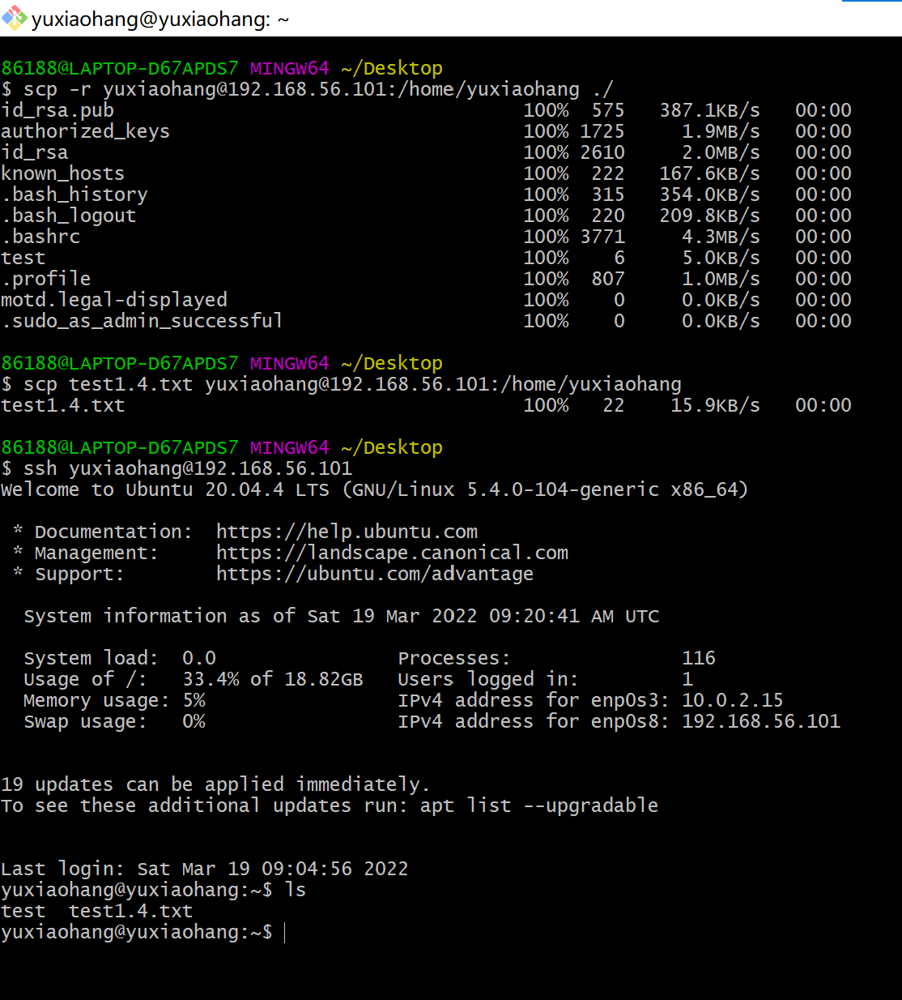

本机和远程Linux系统之间传输文件：
使用阿里云作为远程Linux系统
在阿里云上建立text1.5文件
在宿主机上建立text1.6文件
如下图：

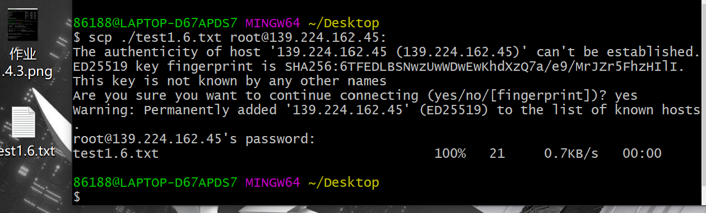

使用scp代码传输
ls代码查看
可以看到下图界面出现“hello”“text1.5”“text1.6”三个文件，其中“hello”文件为其他同学的远程传输文件

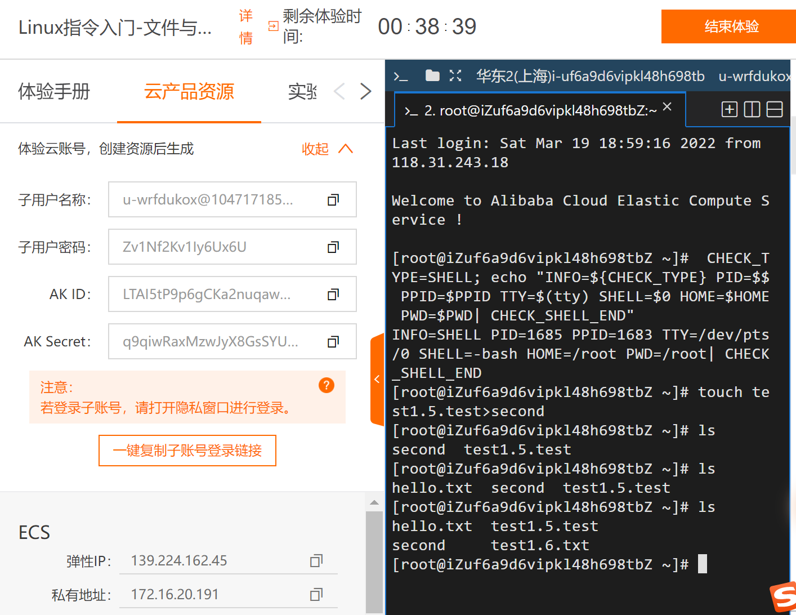

4.如何配置SSH免密登录?

代码ssh-keygen -t rsa建立公私钥对
建立完成如下：

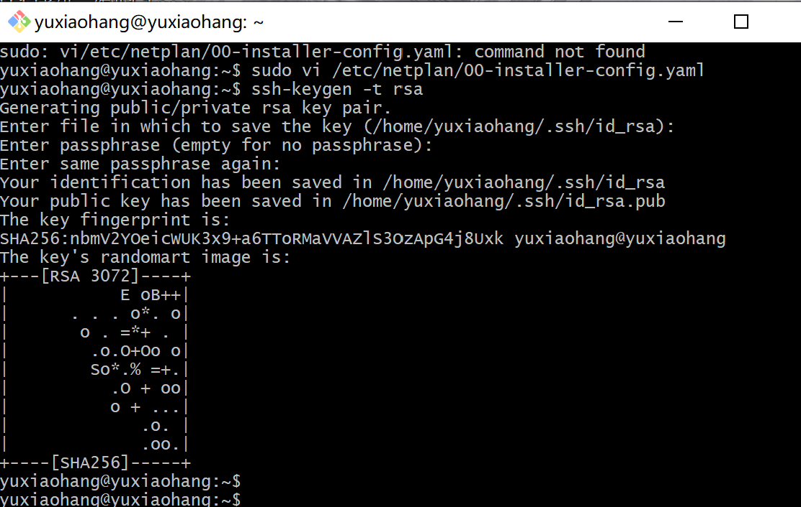

代码ssh-copy-id -i ~/.ssh/id_rsa.pub yuxiaohang@192.168.56.101将新创立的公私钥对代码发给虚拟机
执行结果如下：

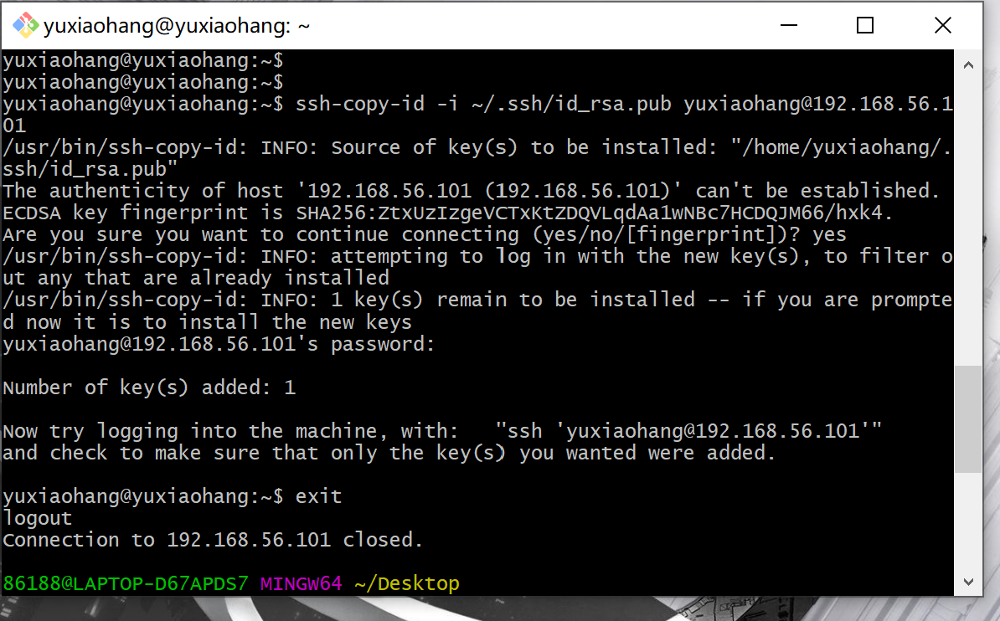

执行失败

更换代码ssh-copy-id yuxiaohang@192.168.56.101

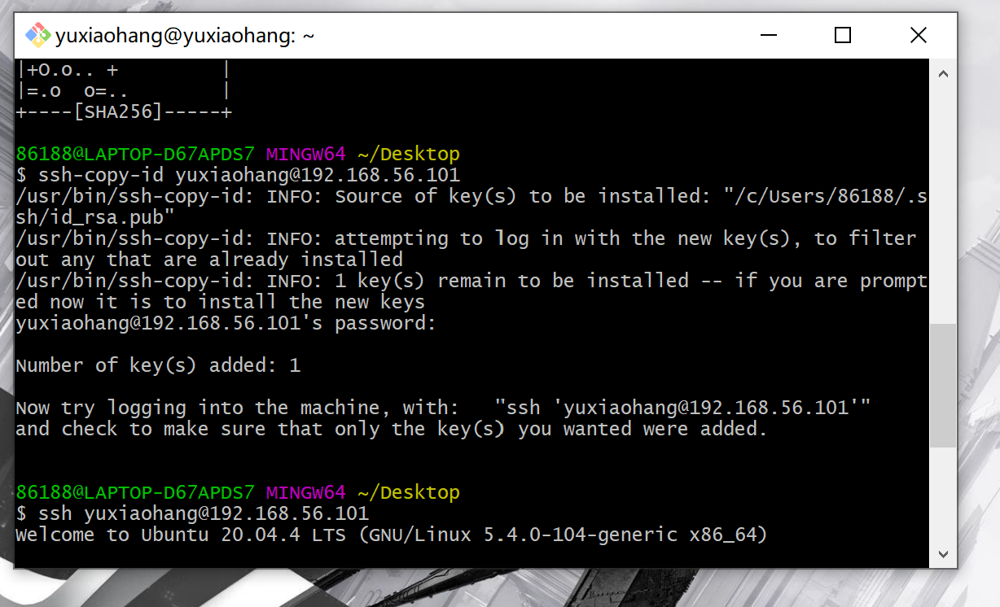

执行成功，结果如下：

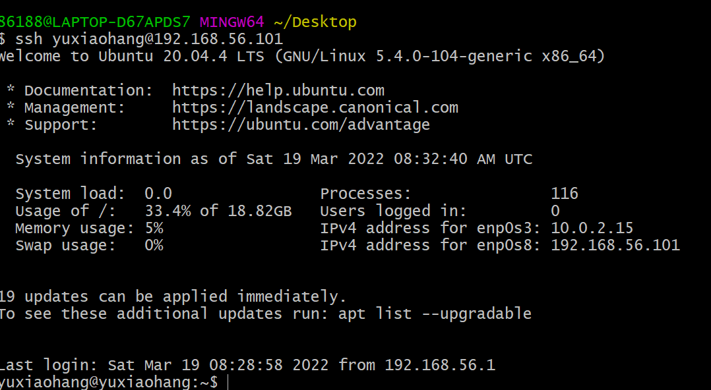
