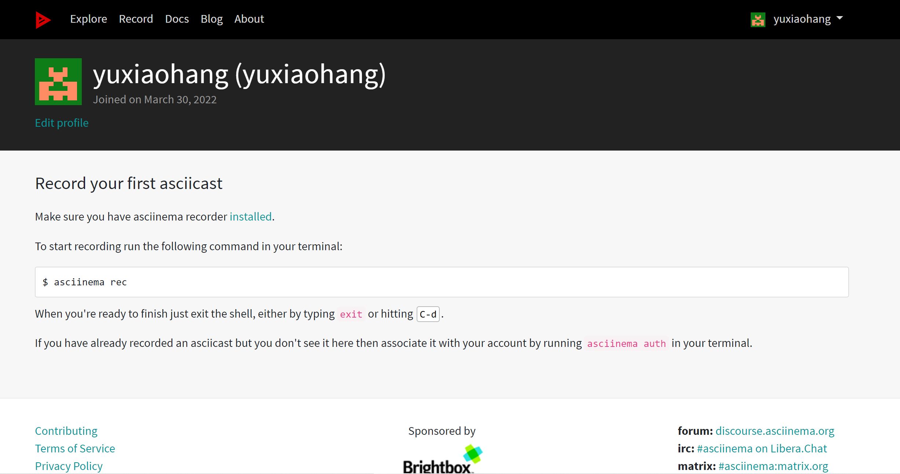
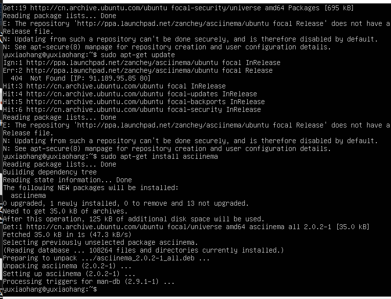
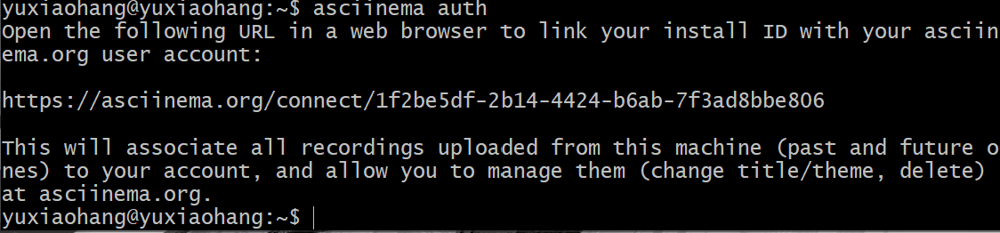
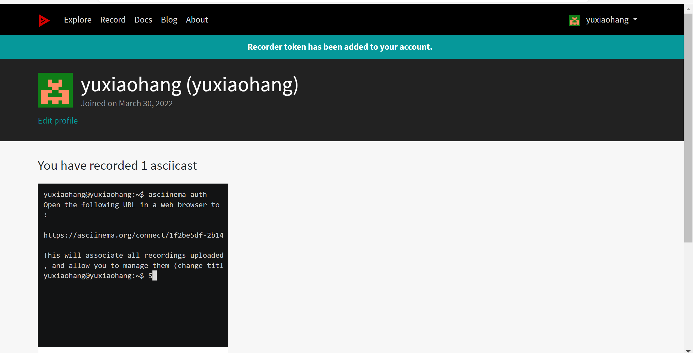

软件环境

当前课程推荐的 Linux 发行版本

 本地环境（Ubuntu）
 云环境（CentOS）
在asciinema注册一个账号，

并在本地安装配置好asciinema

确保本地已经完成asciinema auth，并在asciinema成功关联了本地账号和在线账号

https://asciinema.org/connect/1f2be5df-2b14-4424-b6ab-7f3ad8bbe806

实验问题

使用表格方式记录至少 2 个不同 Linux 发行版本上以下信息的获取方法

|   版 本  |          ubuntu         |     centos   |
|----------|:-----------------------:|-------------:|
| 安装应用  |     sudo apt install    | yum install |
| 查看路径  |         dpkg -L         |  rpm -qal   |
| 卸载应用  |sudo apt-get --purge remove tshark|   yum -y remove wireshark |
| 查找文件名| sudo find . -name '*666*' | sudo find . -name '*666*' |
|查找文件内容| sudo grep -r "666" ./ | sudo grep -r "666" ./|
| 压缩命令 |zip，gzip，tar -cvf，bzip2，7z a -t7z -r，rar a|zip，gzip，tar -cvf，bzip2，7z a -t7z -r，rar a|
| 解压缩命令|unzip -o，gzip -dv，tar -xvf，bunzip2，7z x 1.7z -r -o./，rar x|unzip -o，gzip -dv，tar -xvf，bunzip2，7z x 1.7z -r -o./，rar x|
|获取目标系统CPU|cat /proc/cpuinfo \|grep 'model name'|grep 'model name'/proc/cpuinfo|
|获取内存 | cat /proc/meminfo \|grep MemTotal |cat /proc/meminfo |grep MemTotal|
|获取硬盘信息|sudo fdisk -l \|grep Disk | fdisk -l \|grep Disk |

使用 asciinema 录屏方式「分段」记录相关信息的获取过程和结果

【软件包管理】

在目标发行版上安装 tmux 和 tshark；

查看这 2 个软件被安装到哪些路径；

卸载 tshark 并验证 tshark 卸载结果；

【文件管理】

复制以下 shell 代码到终端运行，在目标 Linux 发行版系统中构造测试数据集，然后回答以下问题：

找到 /tmp 目录及其所有子目录下，文件名包含 666 的所有文件
找到 /tmp 目录及其所有子目录下，文件内容包含 666 的所有文件
 

【文件压缩与解压缩】
以zip为例子

【跟练】 子进程管理实验

【硬件信息获取】目标系统的 CPU、内存大小、硬盘数量与硬盘容量

参考资料：https://www.cnblogs.com/hacker001/articles/10194479.html

