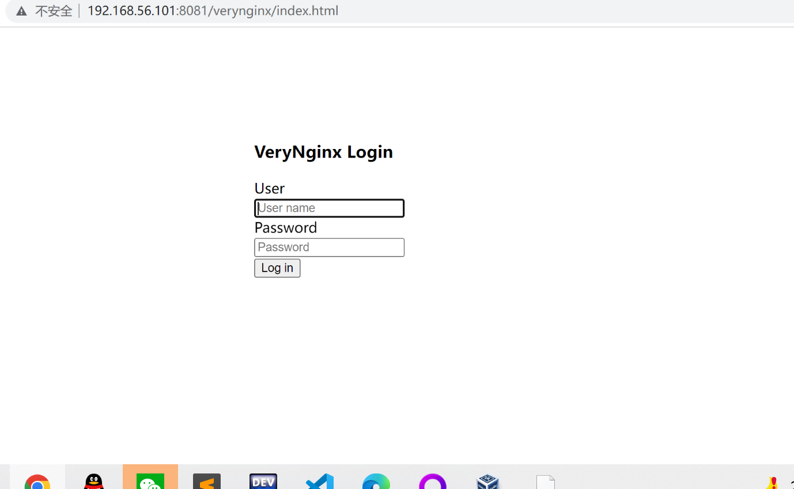
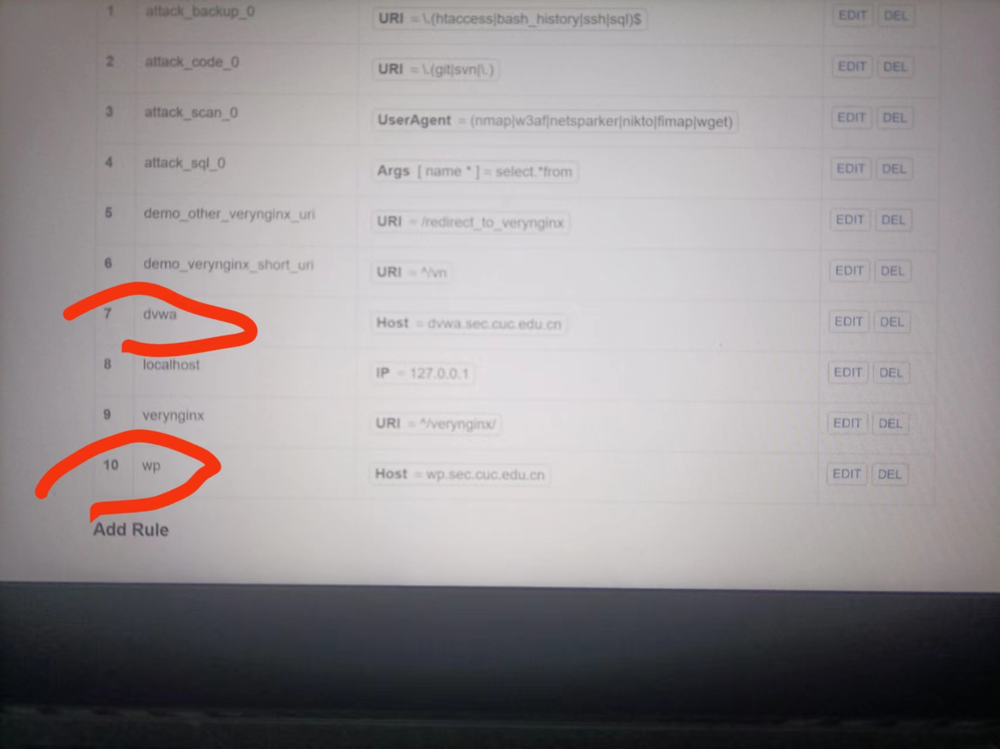
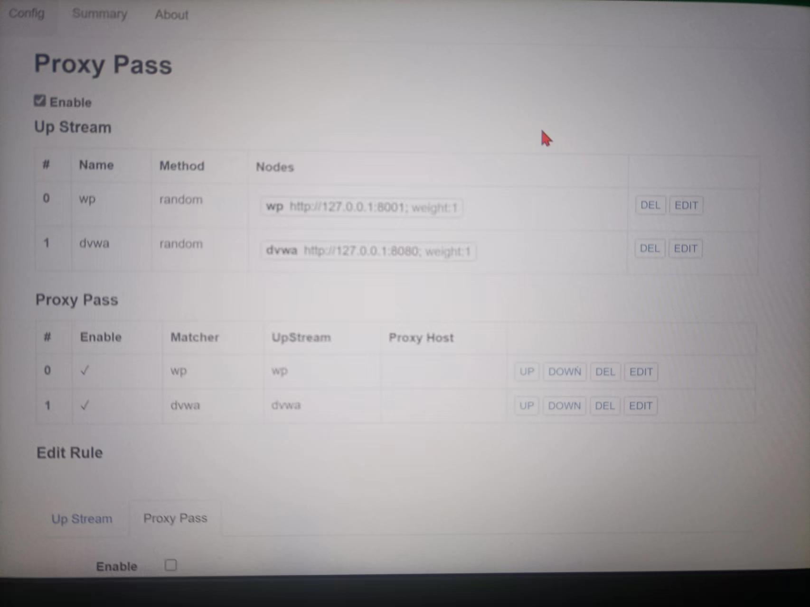
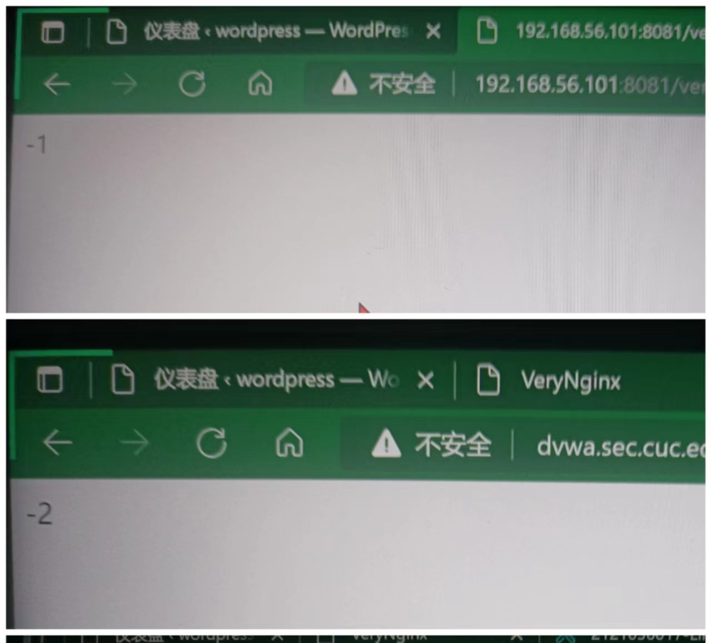
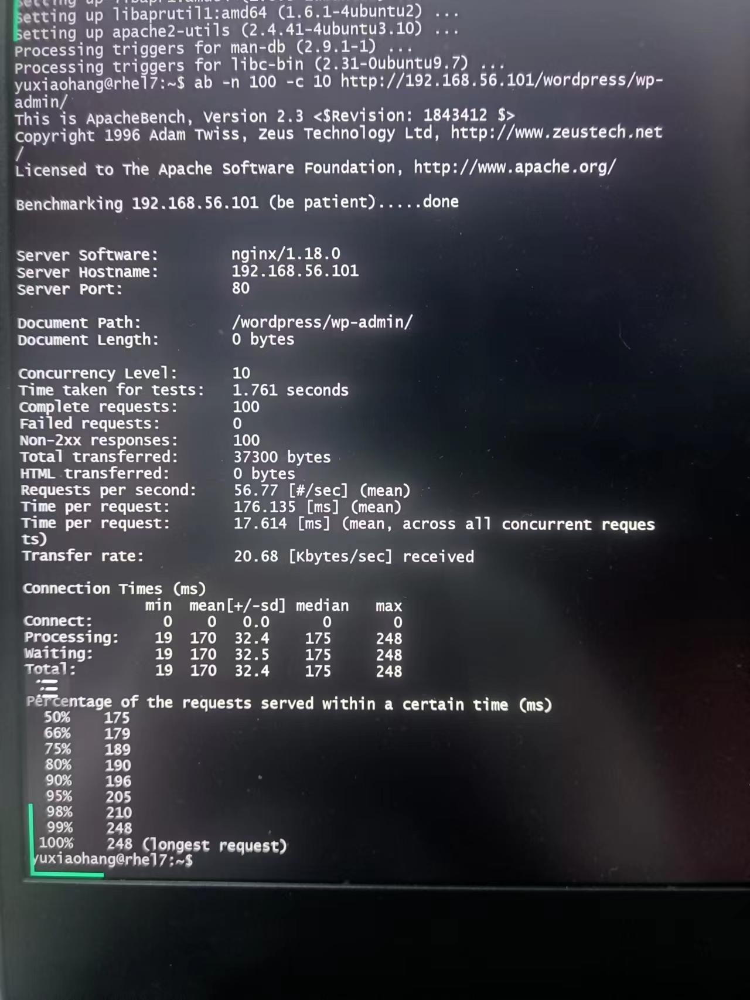

一.软件环境
Nginx
VeryNginx
Wordpress

二.基本要求
1.在一台主机（虚拟机）上同时配置Nginx和VeryNginx
  VeryNginx作为本次实验的Web App的反向代理服务器和WAF
  PHP-FPM进程的反向代理配置在nginx服务器上，VeryNginx服务器不直接配置Web站点服务

2.使用Wordpress搭建的站点对外提供访问的地址为： http://wp.sec.cuc.edu.cn

3.使用Damn Vulnerable Web Application (DVWA)搭建的站点对外提供访问的地址为： http://dvwa.sec.cuc.edu.cn

三.安全加固要求
1.使用IP地址方式均无法访问上述任意站点，并向访客展示自定义的友好错误提示信息页面-1

2.Damn Vulnerable Web Application (DVWA)只允许白名单上的访客来源IP，其他来源的IP访问均向访客展示自定义的友好错误提示信息页面-2

3.在不升级Wordpress版本的情况下，通过定制VeryNginx的访问控制策略规则，热修复WordPress < 4.7.1 - Username Enumeration

4.通过配置VeryNginx的Filter规则实现对Damn Vulnerable Web Application (DVWA)的SQL注入实验在低安全等级条件下进行防护

四.VeryNginx配置要求
1.VeryNginx的Web管理页面仅允许白名单上的访客来源IP，其他来源的IP访问均向访客展示自定义的友好错误提示信息页面-3

2.通过定制VeryNginx的访问控制策略规则实现：
 限制DVWA站点的单IP访问速率为每秒请求数 < 50
 限制Wordpress站点的单IP访问速率为每秒请求数 < 20
 超过访问频率限制的请求直接返回自定义错误提示信息页面-4
 禁止curl访问

 
 五.实验过程
 (一)搭建环境
1.更改Windows主机hosts文件：
192.168.56.101 vn.sec.cuc.edu.cn
192.168.56.101 dvwa.sec.cuc.edu.cn
192.168.56.101 wp.sec.cuc.edu.cn

2.克隆VeryNginx仓库
git clone https://github.com/alexazhou/VeryNginx.git
cd VeryNginx
# python3
sudo python3 install.py install

3.安装python3前对缺失的库补充安装
# zlib
sudo apt-get install zlib1g-dev
# pcre
sudo apt-get update 
sudo apt-get install libpcre3 libpcre3-dev
# gcc 
sudo apt install gcc
# make
sudo apt install make
# penssl library
sudo apt install libssl-dev

4.配置
# 修改 `/opt/verynginx/openresty/nginx/conf/nginx.conf` 配置文件
sudo vim /opt/verynginx/openresty/nginx/conf/nginx.conf

#修改以下部分：

# 用户名
user  www-data;

# 监听端口
# 为了不和其他端口冲突，此处设置为8081
server {
        listen 192.168.56.101:8081;
        
        #this line shoud be include in every server block
        include /opt/verynginx/verynginx/nginx_conf/in_server_block.conf;

        location = / {
            root   html;
            index  index.html index.htm;
        }
    }

5.权限
chmod -R 777 /opt/verynginx/verynginx/configs

6.访问截图：

7.安装配置nginx
sudo apt install nginx

root /var/www/html/wp.sec.cuc.edu.cn;

  # Add index.php to the list if you are using PHP
  index readme.html index.php;

location ~ \.php$ {
	#	include snippets/fastcgi-php.conf;
	#
	#	# With php-fpm (or other unix sockets):
		fastcgi_pass unix:/var/run/php/php7.4-fpm.sock;
		fastcgi_index index.php;
		fastcgi_param SCRIPT_FILENAME $document_root$fastcgi_script_name;
		include fastcgi_params;
	#	# With php-cgi (or other tcp sockets):
#		fastcgi_pass 127.0.0.1:9000;
	}

8.安装wordpress
# 下载
sudo wget https://wordpress.org/wordpress-4.7.zip

# 解压
sudo apt install p7zip-full
7z x wordpress-4.7.zip

# 解压后移至指定路径
sudo mkdir /var/www/html/wp.sec.cuc.edu.cn
sudo cp wordpress /var/www/html/wp.sec.cuc.edu.cn

9.添加数据库
sudo mysql
# 建库
CREATE DATABASE wordpress DEFAULT CHARACTER SET utf8 COLLATE utf8_unicode_ci;
# 新建用户
create user 'dyy'@'localhost' identified by 'xxxxxx';
# 授权
grant all on wordpress.* to 'dyy'@'localhost';

10.改配置
// ** MySQL settings - You can get this info from your web host ** //
/** The name of the database for WordPress */
define('DB_NAME', 'wordpress');

/** MySQL database username */
define('DB_USER', 'username');

/** MySQL database password */
define('DB_PASSWORD', 'password');

# 修改wp-config-sample中的内容，并更名为wp-config
sudo vim wp-config-sample
mv wp-config-sample wp-config

11.访问截图：

12.安装DVWA
# 下载
git clone https://github.com/digininja/DVWA.git
# 建立目录
sudo mkdir /var/www/html/dvwa.sec.cuc.edu.cn
# 移动文件夹内容至该目录下
sudo mv DVWA/* /var/www/html/dvwa.sec.cuc.edu.cn

13.mysql
sudo mysql
CREATE DATABASE dvwa DEFAULT CHARACTER SET utf8 COLLATE utf8_unicode_ci;
CREATE USER 'dvwa'@'localhost' IDENTIFIED BY 'p@ssw0rd';
GRANT ALL ON dvwa.* TO 'dvwa'@'localhost';

14.配置PHP
sudo mv config.inc.php.dist config.inc.php
# 默认配置：
$_DVWA[ 'db_database' ] = 'dvwa';
$_DVWA[ 'db_user' ] = 'dvwa';
$_DVWA[ 'db_password' ] = 'p@ssw0rd';

# 修改php-fpm文件
sudo vim /etc/php/7.4/fpm/php.ini 

display_errors: Off
safe_mode: Off
allow_url_include: On
allow_url_fopen: On

#重启php
systemctl restart php7.4-fpm.service

#授权给www-data用户和组
sudo chown -R www-data.www-data /var/www/html/dvwa.sec.cuc.edu.cn

15.配置服务器
sudo vim /etc/nginx/sites-available/dvwa.sec.cuc.edu.cn

# 写入配置文件
server {
    listen 8080 default_server;
    listen [::]:8080 default_server;

    root /var/www/html/dvwa.sec.cuc.edu.cn;
    index index.php index.html index.htm index.nginx-debian.html;
    server_name dvwa.sec.cuc.edu.cn;

    location / {
        #try_files $uri $uri/ =404;
        try_files $uri $uri/ /index.php$is_args$args;  
    }

    location ~ \.php$ {
        include snippets/fastcgi-php.conf;
        fastcgi_pass unix:/var/run/php/php7.4-fpm.sock;
    }

    location ~ /\.ht {
        deny all;
    }
}

# 创建软链接
sudo ln -s /etc/nginx/sites-available/dvwa.sec.cuc.edu.cn /etc/nginx/sites-enabled/

# 检查并重启服务
sudo nginx -t
systemctl restart nginx.service

16.访问截图：

17.使用VeryNginx反向代理Wordpress,DVWA 截图：

18.安全加固实现截图：

19.在dvwa里面把安全等级改成low截图：

20.其他来源的IP访问均向访客展示自定义的友好错误提示信息页面-3

21.通过定制VeryNginx的访问控制策略规则实现截图：

六.遇到的问题：
1.删除wp（nginx）之后才能进入http://192.168.56.101/wordpress

2.在verynginx管理面板保存配置失败解决代码：sudo chmod -R 777 /opt/verynginx/verynginx/configs 

3.mysql 前要加：<?php 不然会访问失败

4.登录verynginx之前要启动：sudo /opt/verynginx/openresty/nginx/sbin/nginx

七.参考资料：
1.https://blog.csdn.net/wang_624/article/details/89707473
2.https://blog.csdn.net/weixin_30381793/article/details/101661923
3.https://www.cnblogs.com/sanduzxcvbnm/p/11400349.html
4.https://blog.csdn.net/weixin_51112758/article/details/122405471
5.https://blog.csdn.net/weixin_48033524/article/details/115261345
6.https://www.php.cn/cms/wordpress/489263.html
7.https://www.zhihu.com/question/456527243
8.https://github.com/CUCCS/2021-linux-public-Lychee00/blob/chap0x05/chap0x05/exp0x05.md
